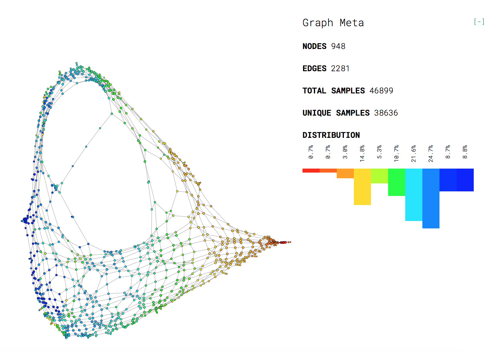
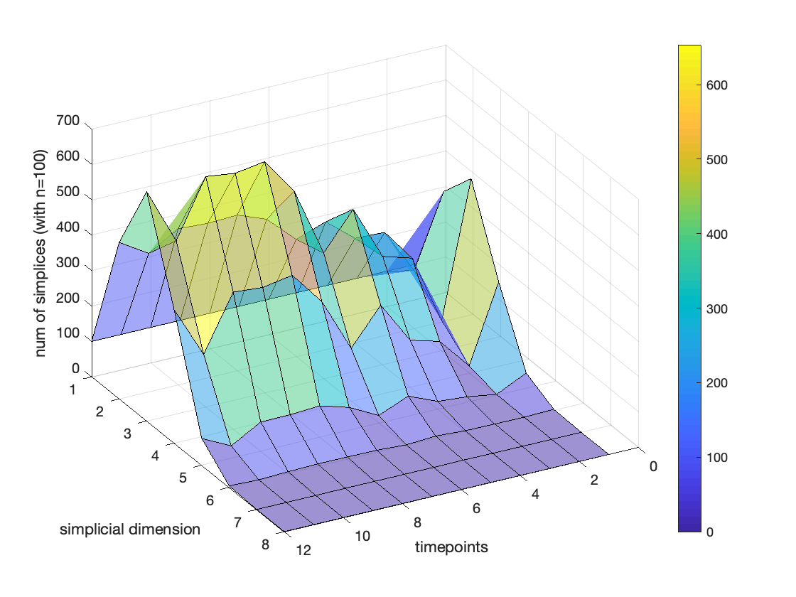

# scTSA

Code for our paper:

 

**"Cliques of single-cell RNA-seq profiles reveal insights into cell ecology during development and differentiation"** in ISMB 2019

by [Baihan Lin](www.baihan.nyc) (Columbia)

and

**"What About Higher-Order Cellular Complexity? An Inquiry with Topological Simplicial Analysis"** in NIPS 2019 Workshop on Learning Meaningful Representations of Life (LMRL)

by [Baihan Lin](http://www.columbia.edu/~bl2681/) (Columbia), [Raul Rabadan](https://rabadan.c2b2.columbia.edu/) (Columbia) and [Nikolaus Kriegeskorte](https://zuckermaninstitute.columbia.edu/nikolaus-kriegeskorte-phd) (Columbia)

Link to the latest full paper to come~

All the experimental results can be reproduced using the code in this repository. Feel free to contact me by doerlbh@gmail.com if you have any question about our work.

**Abstract**

The lack of a formal link between cell-cell cohabitation and its emergent dynamics into cliques during development has hampered our understanding of how cell populations proliferate, differentiate, and compete, i.e. the cell ecology. With the advancement of single-cell RNA-sequencing (RNA-seq), we have now come closer to describing such a link by taking cell-specific transcriptional programs into account, constructing graphs of a network that reflect the similarity of gene expression, and analyzing these graphs using algebraic topology. We proposed single-cell topological simplicial analysis (scTSA). Applying this approach to single-cell gene expression profiles from local networks of cells in different developmental stages with different outcomes revealed a previously unseen topology of cellular ecology. These networks contain an abundance of cliques of single-cell profiles bound into cavities that guide the emergence of more complicated habitation forms. We visualize these ecological patterns with topological simplicial architectures of these networks, compared with the null models. Benchmarked on single-cell RNA-seq of zebrafish embryogenesis over 25 cell types and 12 time steps, our approach highlights the gastrulation as the most critical stage, consistent with consensus in developmental biology. As a nonlinear, model-independent, and unsupervised framework, our approach can also be applied to tracing multi-scale cell lineage, identifying critical stages, or creating pseudo-time series.

## Info

Language: MATLAB, Java, Python3, bash

Platform: MacOS, Linux, Windows

## Citation

If you find this work helpful, please try the models out and cite our work. Thanks!

    @article{lin2019cliques,
      title={{Cliques of single-cell RNA-seq profiles reveal insights into cell ecology during development and differentiation}},
      author={Lin, Baihan},
      booktitle = {Intelligent Systems for Molecular Biology},
      address = {Basel, Switzerland},
      month = {July},
      year={2019}
    }

    @article{lin2019what,
      title={{What About Higher-Order Cellular Complexity? An Inquiry with Topological Simplicial Analysis}},
      author={Lin, Baihan and Rabadan, Raul and Kriegeskorte, Nikolaus},
      booktitle = {NIPS 2019 Workshop on Learning Meaningful Representations of Life (LMRL)},
      address = {Vancouver, Canada},
      month = {December},
      year={2019}
    }

## Requirements

* Python 3, Java
* numpy and scikit-learn

